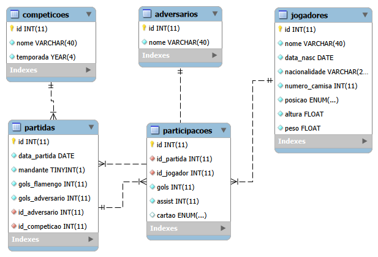

# Flamengo DB — MySQL

Projeto de Estudos - Banco de dados relacional sobre as últimas 5 partidas, jogadores e desempenho do Flamengo, construído em MySQL.

## 🎯 Objetivo

Praticar modelagem relacional (PK, FK, relacionamentos 1:N e N:N) e consultas (JOIN, agregação, GROUP BY, HAVING, CASE WHEN) sobre um domínio real.

## 🗂️ Estrutura

```
flamengo-db-mysql/
├── sql/
│   ├── 01_schema.sql       # estrutura do banco
│   ├── 02_seed.sql         # dados reais
│   └── 03_queries.sql      # consultas analíticas
├── docs/
│   └── der.png             # diagrama entidade-relacionamento
└── README.md
```

## 🧩 Modelo de dados

- **jogadores** — elenco (dados fixos: nome, nascimento, posição, altura, peso)
- **competicoes** — Brasileirão, Libertadores
- **adversarios** — times enfrentados
- **partidas** — jogos, com FK para competição/adversário e placar oficial
- **participacoes** — tabela associativa N:N (jogador × partida), com gols/assistências/cartão *daquela partida*



## ▶️ Como rodar

```bash
mysql -u seu_usuario -p < sql/01_schema.sql
mysql -u seu_usuario -p flamengo_db < sql/02_seed.sql
mysql -u seu_usuario -p flamengo_db < sql/03_queries.sql
```

Rode na ordem (01 → 02 → 03). Pra conferir se populou certo:

```sql
SELECT COUNT(*) FROM jogadores;     -- 23
SELECT COUNT(*) FROM partidas;      -- 5
SELECT COUNT(*) FROM participacoes; -- 78
```

*(usando MySQL Workbench ou outra GUI: abra cada arquivo na ordem e execute o conteúdo)*

## 📊 Exemplo de consulta

**Artilheiro do time (nas últimas 5 partidas):**

| Jogador | Gols |
|---|---|
| Samuel Lino | 3 |
| Pedro | 2 |

*(as outras 6 consultas — aproveitamento, cartões, mandante x visitante, etc. — estão em `sql/03_queries.sql`)*

## 🧠 Principais decisões

- Estatísticas (gols/assistências/cartões) ficam em `participacoes`, não em `jogadores`, evitando dado duplicado, total sempre calculado via `SUM`.
- `gols_flamengo`/`gols_adversario` denormalizados em `partidas`, garantindo o placar oficial mesmo sem granularidade individual completa (ex: gol contra).
- `cartao` é `ENUM` nullable, sem valor `'nenhum'` pois o parâmetro `NULL` já representa a ausência de cartão.
- `competicoes` tem `UNIQUE(nome, temporada)` composto, não em `nome` isolado, pois permite repetir a competição em anos diferentes.
